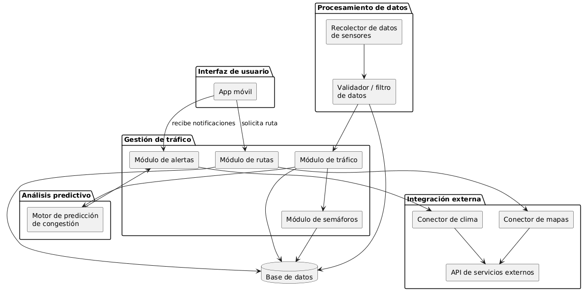
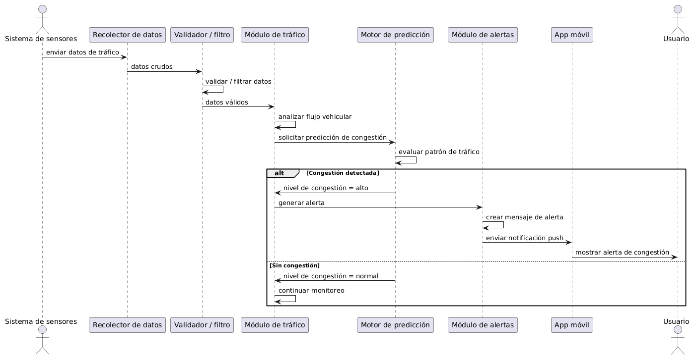
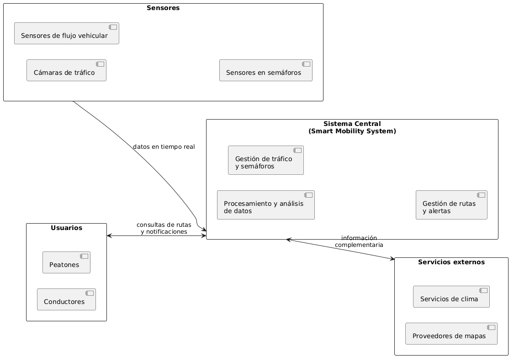

# Fase 3. Construcción de vistas arquitectónicas

## 1. Vista de casos de uso (UML)

Esta vista representa las interacciones entre los actores del sistema y sus funcionalidades principales.

**Actores identificados:**
- Usuario (conductor o peatón)
- Centro de control
- Sistema de sensores
- Servicios externos (mapas, clima)

**Casos de uso principales:**
- Consultar ruta óptima
- Recibir alertas de congestión o incidentes
- Monitorear tráfico en tiempo real
- Detectar congestión
- Generar alerta
- Gestionar semáforos
- Consultar datos de mapas y clima
- Administrar usuarios del sistema

La interacción con **servicios externos** se evidencia en la consulta de datos de mapas y clima, necesarios para calcular rutas óptimas y complementar la generación de alertas.

## 2. Vista lógica (componentes/paquetes UML)

Esta vista representa la estructura interna del sistema en términos de componentes de software y sus relaciones, organizados en los siguientes paquetes:

- **Interfaz de usuario:** contiene la App móvil, punto de entrada para los usuarios.
- **Gestión de tráfico:** agrupa los módulos de tráfico, semáforos, rutas y alertas, el núcleo funcional del sistema.
- **Procesamiento de datos:** recolecta y valida los datos provenientes de los sensores urbanos antes de que sean utilizados por el resto del sistema.
- **Análisis predictivo:** contiene el motor encargado de predecir congestiones a partir de los datos de tráfico procesados.
- **Integración externa:** encapsula los conectores hacia servicios externos de mapas y clima, consumidos a través de una API.

**Relaciones principales:** los datos fluyen desde los sensores (procesamiento de datos) hacia el módulo de tráfico, que alimenta tanto al motor de análisis predictivo como al módulo de semáforos. El módulo de rutas y el módulo de alertas consumen información de los conectores externos (mapas y clima) para enriquecer sus respuestas al usuario. Todos los módulos centrales persisten información en una base de datos común.

## 3. Vista de procesos (diagrama de secuencia)

Esta vista modela el escenario **"Detección de congestión y generación de alerta"**, mostrando la secuencia temporal de mensajes entre los componentes del sistema.

**Flujo del proceso:**
1. El sistema de sensores envía datos de tráfico en tiempo real al recolector de datos.
2. El recolector entrega los datos al validador, que filtra información inconsistente o errónea.
3. El módulo de tráfico analiza el flujo vehicular con los datos ya validados.
4. El motor de predicción evalúa el patrón de tráfico y determina el nivel de congestión.
5. Si se detecta congestión, el módulo de tráfico solicita al módulo de alertas la generación de una notificación, que se envía a la app móvil y se muestra al usuario.
6. Si no hay congestión, el sistema simplemente continúa el monitoreo sin generar alertas.

Esta vista es clave porque muestra el comportamiento dinámico del sistema, es decir, cómo interactúan los componentes en el tiempo para resolver un caso de uso concreto, complementando la estructura estática ya representada en la vista lógica.

## 4. Vista conceptual (diagrama macro)

Esta vista representa la "gran fotografía" del sistema, mostrando sus grandes dominios y cómo se relacionan entre sí, sin entrar en el detalle técnico de componentes o procesos internos.

**Dominios identificados:**
- **Usuarios:** conductores y peatones que interactúan con el sistema para consultar rutas y recibir notificaciones.
- **Sensores:** cámaras, sensores de flujo vehicular y sensores en semáforos, que capturan datos del entorno urbano en tiempo real.
- **Sistema central (Smart Mobility System):** núcleo que procesa los datos, gestiona el tráfico y los semáforos, y calcula rutas y alertas.
- **Servicios externos:** proveedores de mapas y de información climática que complementan la información generada por el sistema.

Esta vista permite entender, de un solo vistazo, el propósito general del sistema y quiénes participan en él, siendo el punto de partida conceptual antes de profundizar en las vistas de casos de uso, lógica y de procesos.