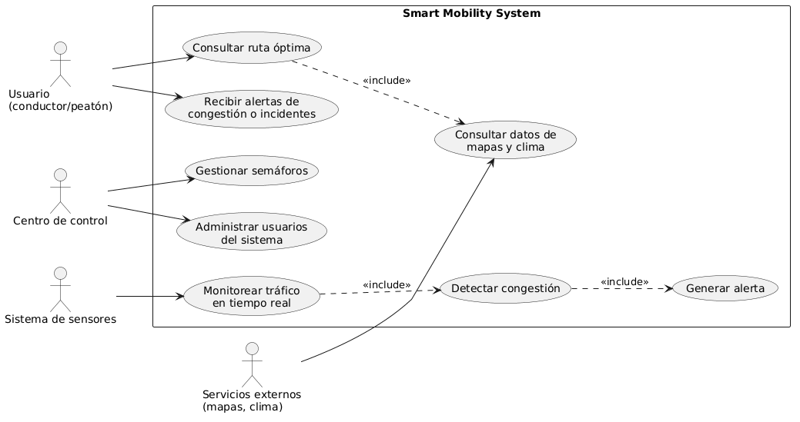

# Fase 3. Construcción de vistas arquitectónicas

## 1. Vista de casos de uso (UML)

Esta vista representa las interacciones entre los actores del sistema y sus funcionalidades principales.

**Actores identificados:**
- Usuario (conductor o peatón)
- Centro de control
- Sistema de sensores
- Servicios externos (mapas, clima)

**Casos de uso principales:**
- Consultar ruta óptima
- Recibir alertas de congestión o incidentes
- Monitorear tráfico en tiempo real
- Detectar congestión
- Generar alerta
- Gestionar semáforos
- Consultar datos de mapas y clima
- Administrar usuarios del sistema

La interacción con **servicios externos** se evidencia en la consulta de datos de mapas y clima, necesarios para calcular rutas óptimas y complementar la generación de alertas.